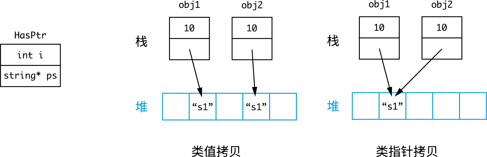
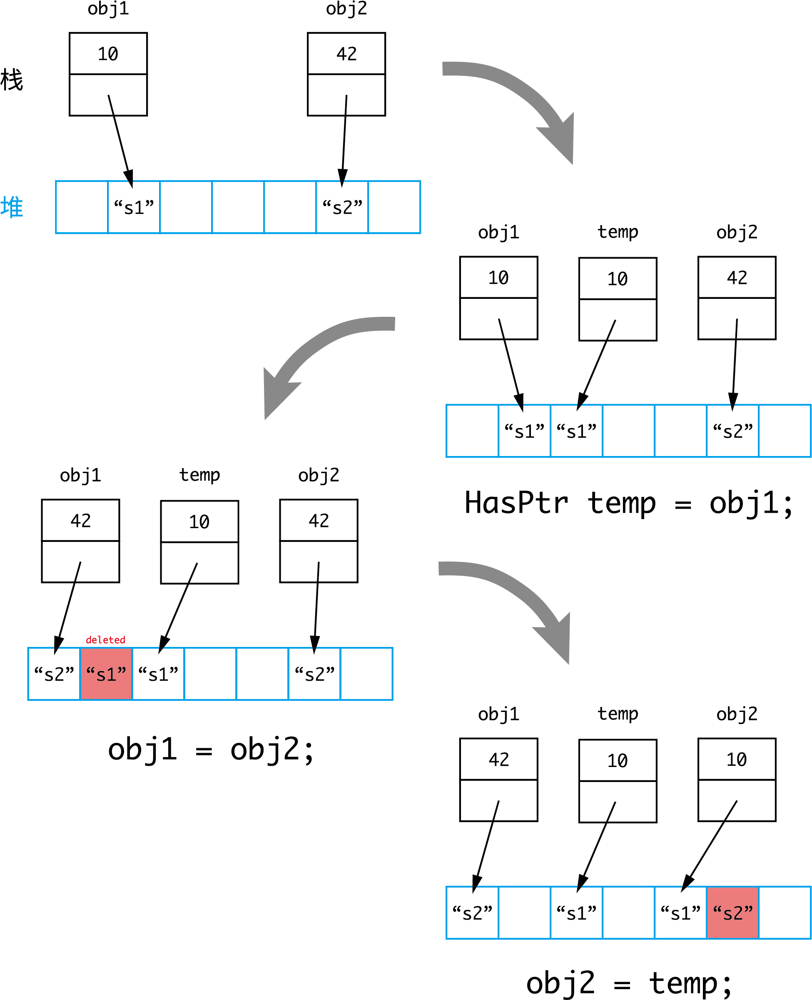

<font size = 7> C++ 笔记 </font>
[TOC]

注: 未注出处的原文引用均来自 *C++ Primer, 5E*
# 基础部分
## 左值与右值
历史上, 左值和右值得名于在赋值表达式中的位置. 赋值号左边的为左值, 右边为右值.

> p.121: 当一个对象被用作右值的时候, 用的是对象的值 (内容); 当对象被用作左值的时候, 用的是对象的身份.

**左值**在内存中占用空间, 具有确定的、可以被获得的内存地址. 取址符 (`&`) 可以作用在其上. 而**右值**没有内存地址, 不可被取址.

> (13.6 p.471) **左值持久; 右值短暂**: 左值具有持久的状态, 而右值要么是字面常量, 要么是在表达式求值的过程中创建的临时对象.

- 左值可以当作右值使用, 此时使用的是左值的内容(值).

``` c++
int i = 42; // i 为左值, 有地址; 42 为右值, 无地址
int j = i; // i 被当作右值使用 (使用其中的值)
```

- 赋值运算符需要**可修改的左值**作为左侧运算对象, 返回结果也是左值. 所以**右值不能被赋值**, (显然, 右值没有地址, 赋值无处可放).

``` c++
int i = 42; // 正确, 赋值运算符左边为左值
12 = i; // 错误, 12 为右值, 不能放在赋值运算符左边
int j = (i = 22); // 正确 i = 22 表达式返回一个左值, 值为 22, 赋给 j
```
- 取址符 `&` 作用于左值对象, **返回指向该对象的指针, 该指针为右值**.

``` c++
int i = 42;
int j = 10;
int* p1 = &i; // &i 为一个指向 i 的右值指针
int* p2 = &j;
&i = j; // 错误: &i 为右值, 不可被赋值
```

## 赋值与初始化
赋值与初始化是不同的. 在变量声明的时候就赋予初值, 为初始化.
``` c++
int i = 0; // 声明, 且初始化
int j;  // 声明, 但不初始化
j = 0;  // 声明后赋值
```

## <a name="init"></a>初始化
### 拷贝初始化与直接初始化 
使用等号 (`=`) 初始化, 实际上执行**拷贝初始化** (copy initialization), 也叫复制初始化; 不用等号, 则执行**直接初始化** (direct initialization). C++11 引入列表初始化, 使用初始化列表来初始化对象. 更多内容, 见 [直接初始化与拷贝初始化的区别](#copy_initialization).
``` c++
int i = j;  // 拷贝初始化
int p(q); // 直接初始化
int k = {0}; // 列表初始化 (拷贝)
int l{0}; // 列表初始化 (直接)
vector<int> vec1 = {1, 2, 3}; // 列表初始化
vector<int> vec2({1, 2, 3}); // 列表初始化
```
### 默认初始化
如果变量定义时没有指定初值, 则变量被**默认初始化** (default initialization), 此时变量被赋予了"默认值":
- 函数体内部的**内置类型变量**将**不被初始化** (uninitialized), 其值未定义
- 定义于任何函数外的变量被初始化为 `0`

### 常见的容器初始化模式
通常情况下, `vector` 类型略去初值, 库会创建一个值初始化的元素初值, 并把它赋给容器中的所有元素. 对于 `int`, 初值为 `0`; 如果元素是类类型, 则由类默认初始化. 
``` c++
vector<int> v1(10); // v1 中有 10 个元素, 默认初始化为 0
vector<int> v2(10, 5); // v2 中有 10 个 5
```
注意区别列表初始化:
``` c++
vector<int> v1{10}; // v1 中有 1 个元素, 值为 10
vector<int> v2{10, 5}; // v2 含 2 个元素, 依次为 10, 5
```

## 迭代器
迭代器使程序员能够遍历整个容器. 类似于指针, 迭代器提供对对象的间接访问. 使用 `begin()` 可以返回指向容器首元素的迭代器; `end()` 返回指向容器尾元素下一位置 (**尾后, off the end**) 元素的迭代器, 常称**尾后迭代器** (**off-the-end iterator**). 
``` c++
vector<int> ivec{1, 2, 3, 4, 5};
auto b = ivec.begin(); // b 指向 ivec 的第一个元素, 1
auto e = ivec.end(); // e 指向 ivec 的尾后元素, 5 后面的不存在的元素
int i = *b; // i 的值为 1
int j = *(b + 2); // j 的值为 3
int dist = e - b; // 差值 (距离) 为 5
```
上面的例子里, `b` 和 `e` 的类型都是 `vector<int>::iterator`. 如果容器是常量, 则迭代器不能修改容器的内容, 只能使用 `const_iterator`.

## 范围 for
``` c++
for (declaration : expression)
    statement
```
`expression` 必须是一个序列, 可以遍历.

举个例子:
``` c++
vector<int> ivec{1, 3, 5, 7, 9};
for (auto& r : ivec)
{
    r *= 2;
}   // ivec 变为 {2, 6, 10, 14, 18}
```


## 泛型编程
C++ 程序员在 for 循环中常使用 `!=` 而非 `<` 或 `<=` 进行判断, 因为这种编程风格在标准库提供的所有容器中都有效.

> 3.4 p.97: 所有标准库容器的迭代器都定义了 `==` 和 `!=`, 但是它们中的大多数都没有定义 `<` 运算符.

举个例子:
``` c++
for (int i = 0; i < 100; i++) // C 风格
/* ... */

for (int i = 0; i != 100; i++) // C++ 风格
/* ... */

for (auto it = s.begin(); it != s.end(); ++it) // C++ 风格
/* ... */
```

## 顶层 const 和底层 const
对于指针和引用, 需要考虑指针/引用本身是否为常量以及其指向/绑定的对象是否为常量两个独立的问题.

顶层 `const`: 指针/引用自身是常量
底层 `const`: 指向/绑定的对象是常量

- **引用自带顶层 `const` 属性, 即当一个引用和它的初始值绑定之后, 就无法改绑至另一对象**
- 顶层 `const` 对象无法被修改, 因此必须初始化

## <a name="const"></a>const 限定符
初始化时, 被初始化的对象是否为 `const` 与初始化对象是否为 `const` 无关, 因为**初始化的操作本质上是拷贝**, 被初始化的对象只需要借用初始化对象的值, 而不需要改变它.

``` c++
int i = 42;
const int j = i; // 正确, 将 i 的值拷贝给 j
int k = j; // 正确, 将常量 j 的值拷贝给 k, 不会改变常量本身
```

但 `const` 出现在指针和引用之中时, 就涉及顶层 `const` 和底层 `const` 两种模式, 此时拷贝操作有限制. 原则是: 执行对象的拷贝操作时, 拷入和拷出的对象必须具有相同的底层 `const` 资格, 或者两者的数据类型能够转换, 即: **拷贝操作不能丢掉底层 `const`, 而顶层 `const` 则被忽略**. 综上:

- 变量可以赋给变量或 `const`, 底层 `const` 可以赋给底层 `const`, 不能赋给变量.

``` c++
const int ci = 10;
int i = 42;
int j = ci; // 正确: 拷贝时顶层 const 被忽略

const int* p1 = &ci; // 正确, &ci 和 p1 有相同的 const
int* p2 = &ci; // 错误, 指向常量的 &ci 赋给普通指针 p2 丢掉了底层 const
int* const p3 = &ci; // 错误, 丢掉底层 const

//  &i 为普通指针, 下面的语句都正确
int* p4 = &i;
const int* p5 = &i;
int* const p6 = &i;
const int* const p7 = &i;
``` 

- 函数中, 形参初始化的机理与变量初始化一样 (6.2 p.187), 都是将实参的值拷贝给形参, 此时形参的顶层 const 被忽略掉了, 此时传递给它常量和非常量都是正确的.

``` c++
void func1(const int a);
void func2(int a); // 错误, 重复定义, 与 func1 相同
int i = 42;
const int ci = 10;

func1(i); // 正确, 相当于 const int a = i;
func1(ci); // 正确, 相当于 const in a = ci;
```
- 所以根据前文所讲的, 形参为指针和引用时, 底层 `const` 时不能忽略的, 初始化过程同样遵循 "**不能丢掉底层 `const`**" 的原则. 

``` c++
void func1(int* ptr); 
void func2(const int* ptr); // 形参不同于 func1()
int i = 42;
const int ci = 10;

func1(&i); // 正确, 相当于 int* ptr = &i;
func1(&ci); // 错误, 相当于 int* ptr = &ci; 丢掉了底层 const
func2(&i); // 正确, 相当于 const int* ptr = &i;
func2(&c1); // 正确, 相当于 const int* ptr = &ci;
```

`const` 限定符以及 "不能丢掉底层 `const`" 的原则在 [类型转换](#cast) 一节还有叙述.

## 复杂声明
下面方法来自《C专家编程》, 可以推广到 C++ 中
>理解 C 语言声明的优先级规则
> 1. 声明从它的名字开始读取, 然后按照优先级顺序依次读取
> 2. 优先级顺序从高到低依次是:
>    - 声明中被括号括起来的部分
>    - 后缀操作符: `()` 表示函数, `[]` 表示数组
>    - 前缀操作符: `*` 表示指针
> 3.  如果 `const` 和 (或) `volatile` 关键字后面紧跟类型说明符 (如 `int`, `long` 等), 那么它作用于类型说明符. 其它情况下 `const`, `volatile` 关键字作用于左边的符号.

对于第三点, 可以解释为, `const` 关键字总是作用于左边的符号, 除非左边没有符号或右边是类型说明符, 此时才与右侧符号结合.

例:
``` c++
const int* p1; // p1 是指向 const int 的指针
int const* p2; // const 作用于 int, p2 和 p1 含义相同
```

例: `char * const *(*fp)();`
``` c++
fp // 标识符
*fp // fp 是指针
(*fp)() // 后缀高于前缀, 与 () 结合, *fp 是函数, fp 是函数指针
*(*fp)() // fp 指向函数, 这个函数返回值是一个指针
const *(*fp)() // const 右边没有类型说明符, 那么看向左边
* const *(*fp)() // 返回的这个指针又指向常量指针, 
char * const *(*fp)() // 这个指针指向的常量指针指向 char
```
所以, `fp` 是指向一个函数的指针, 这个函数返回一个指针, 这个指针又指向一个 char 型的常量指针.


# 表达式
## 优先级与结合律
**优先级规定哪些运算对象优先进行运算, 当优先级相同时, 才根据结合律判断哪些对象结合.**

当 `a * b * c` 满足左结合律时, 结合方式: `(a * b) * c`; 当 `a * b * c` 满足右结合律: `a * (b * c)`. 

- **同一优先级的运算符具有相同的结合律**

- 大多数时候, 求值顺序都未规定: 如 `f1() + f2()` 中, 先求 `f1()` 还是 `f2()` 是不确定的 

- 常用运算符优先级及结合律列出如下:
<style type="text/css">
.tg  {border-collapse:collapse;border-spacing:0;}
.tg td{font-family:Arial, sans-serif;font-size:14px;padding:10px 5px;border-style:solid;border-width:1px;overflow:hidden;word-break:normal;border-color:black;}
.tg th{font-family:Arial, sans-serif;font-size:14px;font-weight:normal;padding:10px 5px;border-style:solid;border-width:1px;overflow:hidden;word-break:normal;border-color:black;}
.tg .tg-z5o4{font-family:Monaco, monospace !important;;text-align:center;vertical-align:middle}
.tg .tg-m2jw{font-family:Monaco, monospace !important;;text-align:center;vertical-align:top}
</style>
<table class="tg">
  <tr>
    <th class="tg-z5o4">结合律</th>
    <th class="tg-z5o4">优先级</th>
  </tr>
  <tr>
    <td class="tg-z5o4">左</td>
    <td class="tg-z5o4">成员访问 .<br>成员访问 -&gt;<br>下标 []<br>函数调用 ()<br>后置 ++ 和 --</td>
  </tr>
  <tr>
    <td class="tg-m2jw">右</td>
    <td class="tg-m2jw">前置 ++ 和 --<br>解引用 *<br>取地址 &amp;</td>
  </tr>
</table>

常见例子:
``` c++
*p++  // *(p++)
*++p  // *(++p)
*obj.f() // *(obj.(f()))
```

## 递增和递减
从表达式的角度上看, 前置 `++` (或 `--`) 运算符将运算对象加 1 (或减 1), 然后将**改变后的对象作为求值结果**. 相反, 后置版本的运算符将对象递增/递减后, **返回对象改变之前的副本作为求值结果**.

``` c++
int i = 18;
int j = ++i; // 递增 i, i 变为 19. 返回 19, 故 j 的值为 19
int k = i++; // 递增 i, i 变为 20. 返回递增前的值 19, 故 k 的值为 19

```

## 短路求值
对于逻辑运算符与 `&&` 和或 `||`, 都是先求左侧运算对象的值, 只有在左侧运算对象无法确定表达式的结果时才会计算右侧运算对象.

``` c++
bool a = 1 || x // 结果必然为真, 无需确定 x 的值
bool b = 0 && x // 结果必然为假, 无需确定 x 的值
```


## <a name="cast"></a>类型转换
### 隐式转换
- 数组转换成指针: 在大多数用到数组的表达式中, 数组名自动转换成指向数组首元素的指针

``` c++
int arr[10];
int* p = arr + 3; // 此处的 arr 等价于 *(arr[0])
```
当数组作为取址符 (&), sizeof 及 typeid 运算符的运算对象或作为 decltype 的参数时, 不会发生隐式转换

- 转换成常量
正如 [const 限定符](#const) 一节中提到的原则, "不能丢掉底层 const", 允许一个普通指针(引用)向相应类型的指向常量的指针(引用)转换, 但不允许相反的转换, 因其试图删除底层 const.
``` c++
int i = 42;
const int &j = i; // 非常量转换为 const int 的引用
const int *p = &i; // 非常量的地址转换成 const 的地址
int &r = j; // 错误: 不允许 const 转换成非常量
int *q = p; // 错误: 同上
```
### 显式转换
- `static_cast`
任何具有明确定义的类型转换, 只要不包含底层 `const`, 都可以使用 `static_cast`

- `const_cast`
唯一能够去掉底层 const 性质的做法是使用 ```const_cast``` 函数, 该函数也只能够改变运算对象的底层 `const`. 将常量对象转换成非常量对象的行为被称为 cast away.

# 函数
## 自由函数与成员函数
声明在类内, 作为类的成员的函数称为成员函数. 若一个函数不再类内, 则是自由函数. 调用方式上:
``` c++
freeFunc(a, b); // 自由函数
a.membFunc(b); // 成员函数
```
## 参数传递
参数传递分为两种: 传值 (passed by value) 和传引用 (passed by reference).

传值参数时, 实参的值被**拷贝**给形参, 此时形参与实参相互独立, 函数对形参所做的所有操作都不会影响实参.

而传引用则是将形参绑定到初始化它的实参上. 引用即别名, 和普通的引用一样, 对引用的操作实际上时作用在引用所引的对象上.

## 返回类型
> (6.3 p.201) 返回一个值的方式和初始化一个变量或形参的方式完全一样: 返回的值用于初始化调用点的一个临时量, 该临时量就是函数调用的结果.

此外要注意返回值是被拷贝到调用点的. 返回引用, 则该引用仅是它所引对象的一个别名.

**不要返回局部对象的引用或指针**, 函数结束后, 局部对象的储存空间被释放掉了:
``` c++
int& f()
{
  int i = 42;
  return i; // 严重错误
}
```

# 泛型算法
## 算法形参模式
> (10.5.2 p.367) 在任何其他算法分类之上, 还有一组参数规范. 理解这些参数规范对学习新算法很有帮助——通过理解参数的含义, 你可以将注意力集中在算法所作的操作上.

大多数算法具有如下 4 种形式之一:
``` c++
alg(beg, end, other args);  // beg, end 输入范围
alg(beg, end, dest, other args);  // dest 目的位置
alg(beg, end, beg2, other args);  // 接受单个目标迭代器 beg2, 何时结束由输入范围决定
alg(beg, end, beg2, end2, other args); // beg2, end2 第二个范围, 指定目的位置
```


# 动态内存与智能指针
## C++ 内存分配
C++ 中, 内存被分为 5 个区, 下面介绍其中 3 个
### 栈
函数内部的局部自动变量被分配在栈中. 当变量被声明时, 一块栈内存被分给该变量, 并在程序离开块作用域时自动释放. 变量的销毁是自动控制的, 所以称其为"自动变量".

### 堆
通过 `new` 运算符分配的内存块位于堆上, `new` 创建的对象不会被自动销毁, 只有通过 `delete` 释放内存.

### 静态内存
保存局部 `static` 对象, 类 `static` 数据成员以及定义在任何函数外的的变量.

``` c++
{
    A obj();
    auto p = &obj;
    auto p1 = new A(); 
    auto p2 = new A();
    delete p2;
}
// 离开作用域, p1 和 p2 以及 p2 指向的对象被销毁 (调用类 A 的析构函数), p1 指向对象还在
// 上面是动态内存的情况, 只有 delete 能销毁
// 对于 obj, 它是栈内的局部自动对象, 离开作用域后自动销毁; 所以 p 和 obj 都被销毁了
```

## 智能指针
### `make_shared` 和 `new`
`make_shared` 也创建新对象, 为其分配内存. 区别在于: `make_shared` 返回 `shared_ptr`, `new` 返回内置指针.

### `shared_ptr` 计数器
当 `shared_ptr` 之间发生拷贝时, 参与拷贝的智能指针引用计数器递增. 注意:
- **拷贝仅限于智能指针之间**, 比如: 智能指针和内置指针之间拷贝, 计数器不会递增
- **内置指针不能隐式转换为智能指针**, 这样写是错误的: `shared_ptr<int> p = new int(42);`, 必须用[直接初始化](#init): `shared_ptr<int> p(new int(42));`

``` c++
auto p1 = std::make_shared<int>(42);    // count: 1
std::shared_ptr<int> p2(p1);    // increment
std::shared_ptr<int> p3(std::make_shared<int>(*p1));    // a new object
std::shared_ptr<int> p4(p1.get());  // original object, but independent
```
最终, 4 个指针的计数器分别为: 2, 2, 1, 1. 其中, `p1`, `p2`, `p4` 指向同一对象, 但 `p4` 是独立的智能指针; `p3` 指向另一个对象.

<center></center>

# 拷贝控制
一个类通过五种特殊的成员函数控制其拷贝行为: 
- 拷贝构造函数 (conpy constructor) 
- 拷贝赋值运算符 (copy-assignment operator)
- 移动构造函数 (move constructor)
- 移动赋值运算符 (move-assignment operator)
- 析构函数 (destructor)

**如果没有显式定义这些函数, 编译器会为我们定义**, 但很多时候编译器合成 (synthesize) 的版本并非满足我们的要求.
## 直接初始化和拷贝初始化的区别 <a name="copy_initialization"></a>
> (13.1 p.441) 当使用直接初始化时, 我们实际上时要求编译器使用普通的**函数匹配** 来选择与我们提供的参数最匹配的构造函数.

> 当我们使用拷贝初始化 (copy initialization) 时, 我们要求编译器将**右侧运算对象拷贝到正在创建的对象中**, 如果需要的话还要进行类型转换. 拷贝初始化通常使用拷贝构造函数来完成.

注意: 不要认为调用拷贝构造函数就是拷贝初始化. 直接初始化可以调用用户定义的(普通的)构造函数, 也可以"直接"调用拷贝构造函数 (因为参数匹配, 可以直接用拷贝构造函数创建对象). 所以还是符合此前的定义, 没有 `=` 就是直接初始化, 使用 `=` 就是拷贝初始化.

``` c++
// A 是类类型, 内部定义有构造函数 A(int), 拷贝构造函数 A(const A&)

A obj1(1);  // 直接初始化, 调用用户定义的构造函数 A(int)
A obj2(obj1);  // 直接初始化, 调用拷贝构造函数 A(const A&)
A obj3 = obj1;  // 拷贝初始化, 调用拷贝构造函数
```

拷贝初始化不仅再我们用 `=` 定义变量时会发生, 在下列情况中也会发生
- 将一个对象作为实参传递给一个**非引用**类型的形参 (6.2 p.187): **非引用传参数**
- 从一个返回类型为**非引用类型**的函数返回一个对象 (6.3.2 p.201): **非引用返回值**
- 从花括号列表初始化一个数组中的元素或一个聚合类中的成员 (7.5.5 p.266)

## `explicit` 关键字
`explicit` 用于类内声明构造函数, 类外定义不应重复. 
<style type="text/css">
.tg  {border-collapse:collapse;border-spacing:0;}
.tg td{font-family:Arial, sans-serif;font-size:14px;padding:10px 5px;border-style:solid;border-width:1px;overflow:hidden;word-break:normal;border-color:black;}
.tg th{font-family:Arial, sans-serif;font-size:14px;font-weight:normal;padding:10px 5px;border-style:solid;border-width:1px;overflow:hidden;word-break:normal;border-color:black;}
.tg .tg-cly1{text-align:left;vertical-align:middle}
</style>
<table class="tg">
  <tr>
    <th class="tg-cly1" colspan="3"><code>explicit</code>  &nbsp;&nbsp;&nbsp;&nbsp;&nbsp;&nbsp;&nbsp;&nbsp;&nbsp;&nbsp;&nbsp;&nbsp;&nbsp;&nbsp;&nbsp;&nbsp;&nbsp;&nbsp;&nbsp;(1)</th>
  </tr>
  <tr>
    <td class="tg-cly1" colspan="3"><code>explicit (expr)</code>    &nbsp;&nbsp;&nbsp;&nbsp;&nbsp; (2)&nbsp;&nbsp;&nbsp;(C++20)</td>
  </tr>
</table>

> 链接: https://zh.cppreference.com/w/cpp/language/explicit
> (1) 指定构造函数或转换函数 (C++11 起) 或推导指引 (C++17 起) 为显式, 即它不能用于隐式转换和复制初始化
> (2) `explicit` 说明符可以与常量表达式一同使用. 当且仅当该常量表达式求值为 `true` 时函数为显式 (C++20 起)

下面介绍 C++11 中的特性. 简单地说: `explicit` 禁止利用构造函数进行隐式转换. 举个例子:
``` c++
class A {
public:
    A(int j): i(j) {}
private:
    int i;    
};
```
如此定义, 可以使用 `=` 进行初始化, 如 `A obj = 42;`. 此时存在只有一个参数的构造函数, 编译器会利用这个构造函数实现从整数 `42` 到 `A` 类型对象的隐式转换: 即 `42` 隐式转换为 `A(42)`. 而 `explicit` 关键字禁止了这种转换. 若构造函数前带有该关键字, `A obj = 42;` 这种初始化方式就不再合法. 而应该选择直接初始化, 或显式转换为对应类型.

``` c++
// 链接: https://zh.cppreference.com/w/cpp/language/explicit
struct A
{
    A(int) { }      // 转换构造函数
    A(int, int) { } // 转换构造函数 (C++11)
};
 
struct B 
{
    explicit B(int) { }
    explicit B(int, int) { }
};
 
int main()
{
    A a1 = 1;      // OK：复制初始化选择 A::A(int)
    A a2(2);       // OK：直接初始化选择 A::A(int)
    A a3 {4, 5};   // OK：直接列表初始化选择 A::A(int, int)
    A a4 = {4, 5}; // OK：复制列表初始化选择 A::A(int, int)
    A a5 = (A)1;   // OK：显式转型进行 static_cast
 
//  B b1 = 1;      // 错误：复制初始化不考虑 B::B(int)
    B b2(2);       // OK：直接初始化选择 B::B(int)
    B b3 {4, 5};   // OK：直接列表初始化选择 B::B(int, int)
//  B b4 = {4, 5}; // 错误：复制列表初始化不考虑 B::B(int,int)
    B b5 = (B)1;   // OK：显式转型进行 static_cast
}
```

## 复制省略与返回值优化
``` c++
class Point {
public:
    Point(double i, double j): x(i), y(j) {}  // 用户定义构造函数
    Point(const Point& p) // 拷贝构造函数
private:
    double x = 0.0;
    double y = 0.0;
};

/* 此处为成员函数定义 */
Point operator+(const Point& lhs, const Point& rhs); // 此处省略重载 Point 之间的 + 函数的定义

int main()
{
    Point p1(2, 3);
    Point p2(4, 5);
    Point p3 = p1 + p2; // 此处调用用户定义的构造函数
    Point p4(Point(1, 5));  // 此处同样调用用户定义的构造函数
}
```
`p3` 和 `p4` 的初始化本来应该调用拷贝构造函数, 但是大多数编译器会绕过拷贝构造函数, 即将 `p4(Point(1, 5))` 变成 `p4(1, 5)`. 这种绕过不必要拷贝操作的优化技术叫做"复制省略"(copy elision).

返回值省略 (Return value optimization, RVO) 也是复制省略的常见形式, 当返回或传值一个临时量时出现. `p3` 的初始化使用了重载的加法运算符, 重载运算符本质上就是函数, `operator+` 的返回值是 `Point` 类临时量, 所以编译器省略了拷贝操作, 用 `Point(double, double)` 的构造函数直接初始化. 

> 如果编译器绕过了拷贝构造函数, 那么被绕过的拷贝构造函数必须**存在且可访问**. 如果上面的代码中, 把 `Point(const Point& p)` 写成 `private`, 则程序会报错. 如果删掉拷贝构造函数不写, 编译器会为我们生成一个合成拷贝构造函数 (synthesized copy constructor), 所以实际上还是存在且可访问的.

其它例子如下:
``` c++
struct A {
    A();
    A(const A&);
};

A f1()
{
    return A();
}

A f2()
{
    A temp();
    return temp;
}

void f3(A obj) {}

int main()
{
    A obj1 = f1();  // return value optimization, RVO
    A obj2 = f2();  // named return value optimization, NRVO
    f3(A());  // temporary passed by value
}
```

C++17 强制要求了返回纯右值时的 copy elision.

## 析构函数
以下情况对象会被销毁:
- (局部自动)变量离开作用域时被销毁
- 对象被销毁时, 其成员被销毁
- 容器被销毁时, 其元素被销毁
- 动态分配的对象, 只有在对指向它的指针应用 `delete` 时才会被销毁
- 对于临时对象, 当创建它的完整表达式结束时销毁

析构函数的运行是自动的.

> 当指向一个对象的引用或指针离开作用域时, 析构函数不会执行, 即: 引用/指针被销毁了, 但其指向的对象还在.

``` c++
{
    A obj();
    auto p = &obj;
    auto p1 = new A(); 
    auto p2 = new A();
    delete p2;
}
// 离开作用域, p1 和 p2 以及 p2 指向的对象被销毁 (调用类 A 的析构函数), p1 指向对象还在
// 上面是动态内存的情况, 只有 delete 能销毁
// 对于 obj, 它是栈内的局部自动对象, 离开作用域后自动销毁; 所以 p 和 obj 都被销毁了
```

## 三/五法则
通常需要用户自定义析构函数的类也需要自定义拷贝和赋值操作.
``` c++
class HasPtr {
public:
    HasPtr(const std::string& s = std::string()): ps(new std::string(s)), i(0) {}
    ~HasPtr() {delete ps;}
private:
    int i = 0;
    std::string* ps = nullptr;
}

int main()
{
    {
        HasPtr obj1("apple");
        HasPtr obj2 = obj1; // obj1 和 obj2 中的 ps 指向同一块内存
    }
    // 报错, 对同一块内存释放两次
}
```

## 拷贝控制
一个类需要析构函数，则几乎可以肯定它也需要一个拷贝构造函数和拷贝赋值运算符. 类拷贝的行为可以看起来像一个值或像一个指针. (13.2 p.452)

> 类值拷贝: 当拷贝一个类时, 副本和原对象时完全独立的. 改变副本不会对原对象有任何影响, 反之亦然.

> 类指针拷贝: 当拷贝这个类的对象时, 副本和原对象使用相同的底层数据. 改变副本也会改变原对象, 反之亦然.

类指针拷贝一般出现在包含指针(或类似类型)的类, 类指针拷贝直接拷贝指针的值, 所以副本和原对象中的指针指向同一对象.

以 HasPtr 类为例, 对于 `HasPtr obj2 = obj1;`, 就有如下两种行为:
<center></center>

编写拷贝赋值运算符时, 要确保**自赋值**时能正常工作. 一个好的模式是先讲右侧运算对象拷贝到局部临时对象中, 然后销毁左侧对象, 最后将数据从临时对象拷贝到左侧对象. 看下面的错误例子:
``` c++
HasPtr& HasPtr::operator=(const HasPtr& rhs)
{
    delete ps;  // 释放对象指向的 string
    // 如果 rhs 和 *this 是同一个对象, 我们就将从以释放的内存中拷贝数据 (未定义行为)
    ps = new string(*(rhs.ps));
    i = rhs.i;
    return *this;
}
```

## 交换操作
同样以类值 `HasPtr` 两对象 `obj1` 和 `obj2` 之间的交换为例, 当使用标准库中的函数 `std::swap` 时, 实际上做了下面三步:
``` c++
HasPtr temp = obj1; // obj1 中的 string 被拷贝
obj1 = obj2;    // obj2 中的 string 被拷贝
obj2 = temp;    // obj1 中的string 再次被拷贝
```
过程示意如下:
<center></center>

我们关注的效果是交换两个对象中的指针, 而标准库函数反复调用拷贝构造函数和拷贝赋值函数, 带来很多不必要的内存分配. 所以我们可以编写自己的 `swap` 函数, 更加高效地完成交换操作.

``` c++
class HasPtr {
    friend void swap(HasPtr& lhs, HasPtr& rhs);
    // 其它成员
};

inline
void swap (HasPtr& lhs, HasPtr& rhs)
{
    using std::swap; // 注意此处
    swap(lhs.ps, rhs.ps);
    swap(lhs.i, rhs.i);

    /* 这样写是错误的 
    std::swap(lhs.ps, rhs.ps); */

    // 当然 不使用 std::swap 也是可以的
    // std::string& temp = lhs.ps;
    // lhs.ps = rhs.ps;
    // rhs.ps = temp;
    // i 的交换同理
}
```
上面函数定义中, 不应该使用 `std::swap`, 而应使用 `using std::swap`, 且后面每个 `swap` 调用都应该未加限定, 也就是直接 `swap`. 此时, 如果存在特定类型的 `swap` 版本, 就会优先调用这个版本; 若不存在, 则会调用 `std` 中的版本.

`swap` 可以应用在赋值运算符中. 使用**拷贝并交换 (copy and swap)** 的技术, 可以自动处理自赋值的情况且天然异常安全.
``` c++
HasPtr& HasPtr::operator=(HasPtr rhs) // 注意: 按值传递, 使用右侧对象的副本
{
    // 交换左侧运算对象和局部变量 rhs 的内容
    swap(*this, rhs);
    return *this;
}
```

## 右值引用
将一个对象移动到另一个地方, C++ 会先拷贝对象, 然后再销毁. 这种方法明显不符合人的自然想法. 右值引用的引入则是实现了对象"移动"的功能.

和前面的(左值)引用不同, 右值引用绑定到一个右值上, 且**只能绑定到右值上**. 
``` c++
int i = 42;
int& ref1 = i;  // 正确: 左值引用
int& ref2 = 42; // 错误: 左值引用不能绑定到右值上
int&& ref3 = i; // 错误: 右值引用不能绑定到左值上
int&& ref4 = 42; // 正确: 右值引用
```

变量可以看成是只有一个运算对象而没有运算符的表达式, 因而变量是左值. 所以右值引用类型的变量也自然是左值.
``` c++
int&& ri = 42;  // 正确: 右值引用
int&& rri = ri; // 错误: ri 是左值
```

但通过标准库中的 `move` 函数, 可以显式地将左值转换为对应右值引用.
``` c++
int i = 42;
int&& r = std::move(i); // ok
```