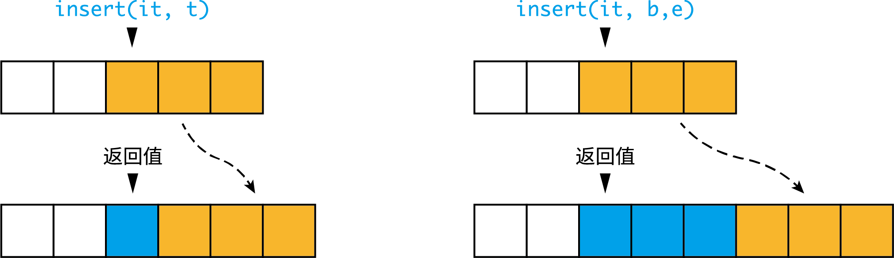
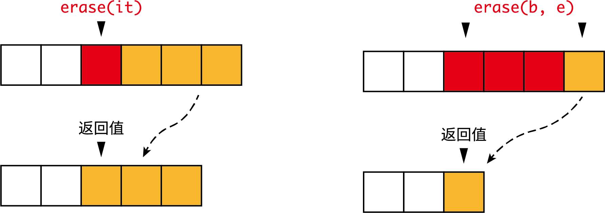
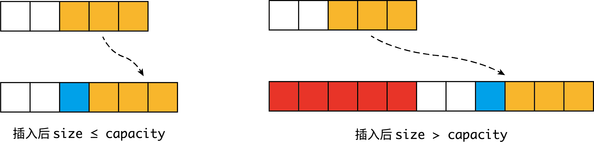
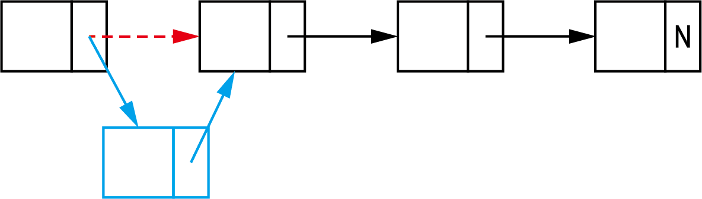
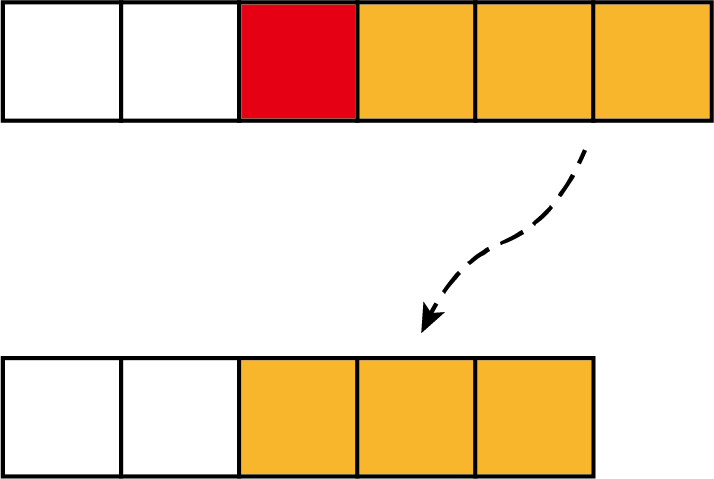
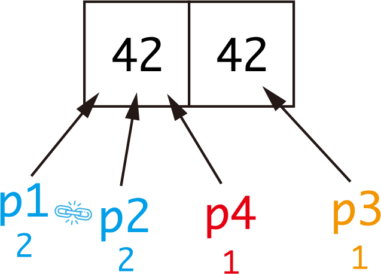

<font size = 7> C++ 笔记 </font>
[TOC]

注: 未注出处的原文引用均来自 *C++ Primer, 5E*
# 1. 基础部分
## 1.1. 左值与右值 <a name="rvalue"></a>
历史上, 左值和右值得名于在赋值表达式中的位置. 赋值号左边的为左值, 右边为右值.

> p.121: 当一个对象被用作右值的时候, 用的是对象的值 (内容); 当对象被用作左值的时候, 用的是对象的身份.

**左值**在内存中占用空间, 具有确定的、可以被获得的内存地址. 取址符 (`&`) 可以作用在其上. 而**右值**没有内存地址, 不可被取址.

> (13.6 p.471) **左值持久; 右值短暂**: 左值具有持久的状态, 而右值要么是字面常量, 要么是在表达式求值的过程中创建的临时对象.

- 左值可以当作右值使用, 此时使用的是左值的内容(值).

``` c++
int i = 42; // i 为左值, 有地址; 42 为右值, 无地址
int j = i; // i 被当作右值使用 (使用其中的值)
```

- 赋值运算符需要**可修改的左值**作为左侧运算对象, 返回结果也是左值. 所以**右值不能被赋值**, (显然, 右值没有地址, 赋值无处可放).

``` c++
int i = 42; // 正确, 赋值运算符左边为左值
12 = i; // 错误, 12 为右值, 不能放在赋值运算符左边
int j = (i = 22); // 正确 i = 22 表达式返回一个左值, 值为 22, 赋给 j
```
- 取址符 `&` 作用于左值对象, **返回指向该对象的指针, 该指针为右值**.

``` c++
int i = 42;
int j = 10;
int* p1 = &i; // &i 为一个指向 i 的右值指针
int* p2 = &j;
&i = j; // 错误: &i 为右值, 不可被赋值
```
- 内置解引用 `*`, 迭代器解引用 `*`, 下标运算符 `[]` 返回左值

## 1.2. 赋值与初始化
赋值与初始化是不同的. 在变量声明的时候就赋予初值, 为初始化.
``` c++
int i = 0; // 声明, 且初始化
int j;  // 声明, 但不初始化
j = 0;  // 声明后赋值
```

## 1.3. <a name="init"></a>初始化
### 1.3.1. 拷贝初始化与直接初始化 
使用等号 (`=`) 初始化, 实际上执行**拷贝初始化** (copy initialization), 也叫复制初始化; 不用等号, 则执行**直接初始化** (direct initialization). C++11 引入列表初始化, 使用初始化列表来初始化对象. 更多内容, 见 [直接初始化与拷贝初始化的区别](#copy_initialization).
``` c++
int i = j;  // 拷贝初始化
int p(q); // 直接初始化
int k = {0}; // 列表初始化 (拷贝)
int l{0}; // 列表初始化 (直接)
vector<int> vec1 = {1, 2, 3}; // 列表初始化
vector<int> vec2({1, 2, 3}); // 列表初始化
```
### 1.3.2. 默认初始化
如果变量定义时没有指定初值, 则变量被**默认初始化** (default initialization), 此时变量被赋予了"默认值":
- 函数体内部的**内置类型变量**将**不被初始化** (uninitialized), 其值未定义
- 定义于任何函数外的全局变量被初始化为 `0`
- 类的对象没有显式地初始化, 其值由类决定. 若类没有声明任何构造函数, 则编译器合成默认构造函数, 行为如下:
  - 如果存在类内初始值, 则用它初始化成员
  - 否则, 默认初始化该成员

### 1.3.3. 常见的容器初始化模式
通常情况下, `vector` 类型略去初值, 库会创建一个值初始化的元素初值, 并把它赋给容器中的所有元素. 对于 `int`, 初值为 `0`; 如果元素是类类型, 则由类默认初始化. 
``` c++
vector<int> v1(10); // v1 中有 10 个元素, 默认初始化为 0
vector<int> v2(10, 5); // v2 中有 10 个 5
```
注意区别列表初始化:
``` c++
vector<int> v1{10}; // v1 中有 1 个元素, 值为 10
vector<int> v2{10, 5}; // v2 含 2 个元素, 依次为 10, 5
```

## 1.4. 迭代器
迭代器使程序员能够遍历整个容器. 类似于指针, 迭代器提供对对象的间接访问. 使用 `begin()` 可以返回指向容器首元素的迭代器; `end()` 返回指向容器尾元素下一位置 (**尾后, off the end**) 元素的迭代器, 常称**尾后迭代器** (**off-the-end iterator**). 
``` c++
vector<int> ivec{1, 2, 3, 4, 5};
auto b = ivec.begin(); // b 指向 ivec 的第一个元素, 1
auto e = ivec.end(); // e 指向 ivec 的尾后元素, 5 后面的不存在的元素
int i = *b; // i 的值为 1
int j = *(b + 2); // j 的值为 3
int dist = e - b; // 差值 (距离) 为 5
```
上面的例子里, `b` 和 `e` 的类型都是 `vector<int>::iterator`. 如果容器是常量, 则迭代器不能修改容器的内容, 只能使用 `const_iterator`.

> 迭代器和 `const` 的关系就像指针和 `const` 的关系一样:
> `std::vector<T>::const_iterator` 就像 `const T*`, 即底层 const, 迭代器指向的值不能改变
> `const std::vector<T>::iterator` 就像 `T* const`, 即顶层 const, 迭代器本身不能改变 

迭代器不是指针, 但行为却和指针类似, 支持对应的运算符.
``` c++
vector<int>::iterator it;

*it;    // 解引用, 返回迭代器指向的元素值
it->mem;    // 等价于 *(iter).mem
++it; --it;     // 同指针, 令 it 指向下/上一个元素
it + n; it - n;     // 返回 n 个位置后/前的迭代器
it += n; it -=n;    // it 移动 n 个位置
```
迭代器操作等价函数: 
`++it` 等价于 `advance(it, 1)`
`--it` 等价于 `advance(it, -1)`
`it + n` 等价于 `next(it, n)`
`it - n` 等价于 `prev(it, n)`
`it += n` 等价于 `advance(it, n)`
`it -= n` 等价于 `advance(it, -n)`

## 1.5. 范围 for
``` c++
for (declaration : expression)
    statement
```
`expression` 必须是一个序列, 可以遍历.

举个例子:
``` c++
vector<int> ivec{1, 3, 5, 7, 9};
for (auto& r : ivec)
{
    r *= 2;
}   // ivec 变为 {2, 6, 10, 14, 18}
```


## 1.6. 泛型编程
C++ 程序员在 for 循环中常使用 `!=` 而非 `<` 或 `<=` 进行判断, 因为这种编程风格在标准库提供的所有容器中都有效.

> 3.4 p.97: 所有标准库容器的迭代器都定义了 `==` 和 `!=`, 但是它们中的大多数都没有定义 `<` 运算符.

举个例子:
``` c++
for (int i = 0; i < 100; i++) // C 风格
/* ... */

for (int i = 0; i != 100; i++) // C++ 风格
/* ... */

for (auto it = s.begin(); it != s.end(); ++it) // C++ 风格
/* ... */
```

## 1.7. 顶层 const 和底层 const
对于指针和引用, 需要考虑指针/引用本身是否为常量以及其指向/绑定的对象是否为常量两个独立的问题.

顶层 `const`: 指针/引用自身是常量
底层 `const`: 指向/绑定的对象是常量

- **引用自带顶层 `const` 属性, 即当一个引用和它的初始值绑定之后, 就无法改绑至另一对象**
- 顶层 `const` 对象无法被修改, 因此必须初始化

## 1.8. <a name="const"></a>const 限定符
初始化时, 被初始化的对象是否为 `const` 与初始化对象是否为 `const` 无关, 因为**初始化的操作本质上是拷贝**, 被初始化的对象只需要借用初始化对象的值, 而不需要改变它.

``` c++
int i = 42;
const int j = i; // 正确, 将 i 的值拷贝给 j
int k = j; // 正确, 将常量 j 的值拷贝给 k, 不会改变常量本身
```

但 `const` 出现在指针和引用之中时, 就涉及顶层 `const` 和底层 `const` 两种模式, 此时拷贝操作有限制. 原则是: 执行对象的拷贝操作时, 拷入和拷出的对象必须具有相同的底层 `const` 资格, 或者两者的数据类型能够转换, 即: **拷贝操作不能丢掉底层 `const`, 而顶层 `const` 则被忽略**. 综上:

- 变量可以赋给变量或 `const`, 底层 `const` 可以赋给底层 `const`, 不能赋给变量.

``` c++
const int ci = 10;
int i = 42;
int j = ci; // 正确: 拷贝时顶层 const 被忽略

const int* p1 = &ci; // 正确, &ci 和 p1 有相同的 const
int* p2 = &ci; // 错误, 指向常量的 &ci 赋给普通指针 p2 丢掉了底层 const
int* const p3 = &ci; // 错误, 丢掉底层 const

//  &i 为普通指针, 下面的语句都正确
int* p4 = &i;
const int* p5 = &i;
int* const p6 = &i;
const int* const p7 = &i;
``` 

- 函数中, 形参初始化的机理与变量初始化一样 (6.2 p.187), 都是将实参的值拷贝给形参, 此时形参的顶层 const 被忽略掉了, 此时传递给它常量和非常量都是正确的.

``` c++
void func1(const int a);
void func2(int a); // 错误, 重复定义, 与 func1 相同
int i = 42;
const int ci = 10;

func1(i); // 正确, 相当于 const int a = i;
func1(ci); // 正确, 相当于 const in a = ci;
```
- 所以根据前文所讲的, 形参为指针和引用时, 底层 `const` 时不能忽略的, 初始化过程同样遵循 "**不能丢掉底层 `const`**" 的原则. 

``` c++
void func1(int* ptr); 
void func2(const int* ptr); // 形参不同于 func1()
int i = 42;
const int ci = 10;

func1(&i); // 正确, 相当于 int* ptr = &i;
func1(&ci); // 错误, 相当于 int* ptr = &ci; 丢掉了底层 const
func2(&i); // 正确, 相当于 const int* ptr = &i;
func2(&c1); // 正确, 相当于 const int* ptr = &ci;
```

`const` 限定符以及 "不能丢掉底层 `const`" 的原则在 [类型转换](#cast) 一节还有叙述.

## 1.9. this 指针
为了确定是哪个对象在调用成员函数, 成员函数引入了名为 `this` 的额外隐式形参. **当调用一个成员函数时, 用请求该函数的对象地址初始化 `this`.** 例如
``` c++
class A {
public:
    void f() { i += 1; }
private:
    int i = 0;
}

int main()
{
    A obj;
    obj.f();
}
```
上面的代码中有类 A, 类中有数据成员 `i` 和成员函数 `f()`, 其中成员函数会用到数据成员.

当调用 `obj.f()` 时, 编译器负责把 `obj` 的地址传递给 `f()` 的隐式形参 `this`, 此时函数知道 `obj` 是它的调用者, 函数内部使用的数据成员就是 `obj` 的数据成员:
``` c++
// 以下为伪代码, 只是表示执行过程
// f() 的隐式形参
void A::f(A* const this)
{
    this->i += 1;
}

// 调用时
f(&obj)
```

**函数内部, 可以直接使用调用该函数的对象的成员, 而无需通过成员访问符.** 当 `f()` 使用 `i` 时, 实际上隐式使用了 `this->i`. 

> `this` 是一个常量指针, 一旦绑定就无法指向其它对象.

## 1.10. 类与 const
### 1.10.4. const 成员函数
以类 `A` 为例, 默认情况下, `this` 指针的类型为 `A* const`; const 成员函数中的 `this` 指针还是一个指向常量的指针 `const A* const`. 也就是说: **const 成员函数中的 `this` 有底层 const, 而普通的成员函数则不是底层 const 的.** 

根据规则, 我们不能将一个常量对象传递给普通的 `this` 指针, 因为这样会丢掉底层 const. 因此我们**不能在常量对象上调用普通的成员函数.** 将成员函数声明成 `const`, 才可以处理常量对象. 同时 const 成员函数也可以接受非常量对象 (编译器可以隐式加上 `const`), 这也增加了灵活性.

> 如果可以, 就应该将成员函数定义为 `const`.

### 避免代码重复 
当类中 const 和非 const 成员函数实质等价时, 可以使非 const 函数调用 const 函数, 已避免代码重复.
``` c++
class TextBlock {
public:
    const char& operator[](std::size_t position) const  // const 成员函数
    {
        // do many things
        return text[position];
    }

    char& operator[](std::size_t position)  // non-cost
    {
        // 先将调用对象转为 const, 使用 const 函数
        // 再将返回值转为非 const
        return const_cast<char&>(static_cast<const TextBlock&>(*this)[position]);
    }
}
```


## 1.11. 复杂声明
下面方法来自《C专家编程》, 可以推广到 C++ 中
>理解 C 语言声明的优先级规则
> 1. 声明从它的名字开始读取, 然后按照优先级顺序依次读取
> 2. 优先级顺序从高到低依次是:
>    - 声明中被括号括起来的部分
>    - 后缀操作符: `()` 表示函数, `[]` 表示数组
>    - 前缀操作符: `*` 表示指针
> 3.  如果 `const` 和 (或) `volatile` 关键字后面紧跟类型说明符 (如 `int`, `long` 等), 那么它作用于类型说明符. 其它情况下 `const`, `volatile` 关键字作用于左边的符号.

对于第三点, 可以解释为, `const` 关键字总是作用于左边的符号, 除非左边没有符号或右边是类型说明符, 此时才与右侧符号结合.

例:
``` c++
const int* p1; // p1 是指向 const int 的指针
int const* p2; // const 作用于 int, p2 和 p1 含义相同
```

例: `char * const *(*fp)();`
``` c++
fp // 标识符
*fp // fp 是指针
(*fp)() // 后缀高于前缀, 与 () 结合, *fp 是函数, fp 是函数指针
*(*fp)() // fp 指向函数, 这个函数返回值是一个指针
const *(*fp)() // const 右边没有类型说明符, 那么看向左边
* const *(*fp)() // 返回的这个指针又指向常量指针, 
char * const *(*fp)() // 这个指针指向的常量指针指向 char
```
所以, `fp` 是指向一个函数的指针, 这个函数返回一个指针, 这个指针又指向一个 char 型的常量指针.


# 2. 表达式
## 2.12. 优先级与结合律
**优先级规定哪些运算对象优先进行运算, 当优先级相同时, 才根据结合律判断哪些对象结合.**

当 `a * b * c` 满足左结合律时, 结合方式: `(a * b) * c`; 当 `a * b * c` 满足右结合律: `a * (b * c)`. 

- **同一优先级的运算符具有相同的结合律**

- 大多数时候, 求值顺序都未规定: 如 `f1() + f2()` 中, 先求 `f1()` 还是 `f2()` 是不确定的 

- 常用运算符优先级及结合律列出如下:
<table class="tg">
  <tr>
    <th class="tg-z5o4">结合律</th>
    <th class="tg-z5o4">优先级</th>
  </tr>
  <tr>
    <td class="tg-z5o4">左</td>
    <td class="tg-z5o4">成员访问 .<br>成员访问 -&gt;<br>下标 []<br>函数调用 ()<br>后置 ++ 和 --</td>
  </tr>
  <tr>
    <td class="tg-m2jw">右</td>
    <td class="tg-m2jw">前置 ++ 和 --<br>解引用 *<br>取地址 &amp;</td>
  </tr>
</table>

常见例子:
``` c++
*p++  // *(p++)
*++p  // *(++p)
*obj.f() // *(obj.(f()))
```

## 2.13. 递增和递减
从表达式的角度上看, 前置 `++` (或 `--`) 运算符将运算对象加 1 (或减 1), 然后将**改变后的对象作为求值结果**. 相反, 后置版本的运算符将对象递增/递减后, **返回对象改变之前的副本作为求值结果**.
``` c++
int i = 18;
int j = ++i; // 递增 i, i 变为 19. 返回 19, 故 j 的值为 19
int k = i++; // 递增 i, i 变为 20. 返回递增前的值 19, 故 k 的值为 19
```
对于前置版本, `++i` 和 `--i` 完全等价于 `i += 1` 和 `i -= 1`; 对于后置版本, 其作用和 `i += 1` 和 `i -= 1` 相同, 只是返回改变前的值.

## 2.14. 短路求值
对于逻辑运算符与 `&&` 和或 `||`, 都是先求左侧运算对象的值, 只有在左侧运算对象无法确定表达式的结果时才会计算右侧运算对象.

``` c++
bool a = 1 || x // 结果必然为真, 无需确定 x 的值
bool b = 0 && x // 结果必然为假, 无需确定 x 的值
```


## 2.15. <a name="cast"></a>类型转换
### 2.15.5. 隐式转换
- 数组转换成指针: 在大多数用到数组的表达式中, 数组名自动转换成指向数组首元素的指针

``` c++
int arr[10];
int* p = arr + 3; // 此处的 arr 等价于 *(arr[0])
```
当数组作为取址符 (`&`), `sizeof` 及 `typeid` 运算符的运算对象或作为 `decltype` 的参数时, 不会发生隐式转换

- 转换成常量
正如 [const 限定符](#const) 一节中提到的原则, "不能丢掉底层 const", 允许一个普通指针(引用)向相应类型的指向常量的指针(引用)转换, 但不允许相反的转换, 因其试图删除底层 const.
``` c++
int i = 42;
const int &j = i; // 非常量转换为 const int 的引用
const int *p = &i; // 非常量的地址转换成 const 的地址
int &r = j; // 错误: 不允许 const 转换成非常量
int *q = p; // 错误: 同上
```
### 2.15.6. 显式转换
- `static_cast`
任何具有明确定义的类型转换, 只要不包含底层 `const`, 都可以使用 `static_cast`

- `const_cast`
唯一能够去掉底层 const 性质的做法是使用 ```const_cast``` 函数, 该函数也只能够改变运算对象的底层 `const`. 将常量对象转换成非常量对象的行为被称为 cast away.

# 3. 函数
## 3.16. 自由函数与成员函数
声明在类内, 作为类的成员的函数称为成员函数. 若一个函数不再类内, 则是自由函数. 调用方式上:
``` c++
freeFunc(a, b); // 自由函数
a.membFunc(b); // 成员函数
```
## 3.17. 参数传递
参数传递分为两种: 传值 (passed by value) 和传引用 (passed by reference).

传值参数时, 实参的值被**拷贝**给形参, 此时形参与实参相互独立, 函数对形参所做的所有操作都不会影响实参.

而传引用则是将形参绑定到初始化它的实参上. 引用即别名, 和普通的引用一样, 对引用的操作实际上时作用在引用所引的对象上.

## 3.18. 返回类型
> (6.3 p.201) 返回一个值的方式和初始化一个变量或形参的方式完全一样: 返回的值用于初始化调用点的一个临时量, 该临时量就是函数调用的结果.

此外要注意返回值是被拷贝到调用点的. 返回引用, 则该引用仅是它所引对象的一个别名.

**不要返回局部对象的引用或指针**, 函数结束后, 局部对象的储存空间被释放掉了:
``` c++
int& f()
{
    int i = 42;
    return i; // 严重错误
}
```
# 4. 容器
- 顺序容器: `vector`, `deque`, `list`, `forward_list`, `array`, `string`
- 关联容器:
  - 有序 (按关键字): `map`, `set`, `multimap`, `multiset`
  - 无序: `unordered_map`, `unordered_set`, `unordered_multimap`, `unordered_multiset`
### 4.18.7. 迭代器范围
两个迭代器表示的范围约定为**左闭右开区间**. 设迭代器 `e` 在 `b` 后面, 则 `b` 和 `e` 表示的范围为 `[b, e)`: 即从 `b` 开始到 `e` 前一个元素构成. **当 `b` 等于 `e` 时 (指向同一元素), 则这两个迭代器构成的范围为空.**
<center></center>

## 4.19. 顺序容器
### 4.19.8. 容器操作
#### 4.19.8.1. 添加
<table class="tg">
<thead>
  <tr>
    <th class="tg-nrix">操作</th>
    <th class="tg-nrix">行为</th>
    <th class="tg-nrix">返回值</th>
  </tr>
</thead>
<tbody>
  <tr>
    <td class="tg-z5o4">insert(p, t)</td>
    <td class="tg-nrix">在 p 前面添加值为 t 的元素</td>
    <td class="tg-nrix" rowspan="3">返回插入的第一个元素,<br>若插入元素为空, 返回插入位置 p</td>
  </tr>
  <tr>
    <td class="tg-z5o4">insert(p, b, e)</td>
    <td class="tg-nrix">将 b 和 e 指定范围的元素添加到 p 前</td>
  </tr>
  <tr>
    <td class="tg-z5o4">insert(p, il)</td>
    <td class="tg-nrix">将花括号包围的列表 il 插入到 p 前</td>
  </tr>
</tbody>
</table>

> 由于是容器的范围是左闭右开区间, 约定插入操作将元素(或范围)插入到指定位置前面有两个好处: 1. 容器的开始位置可以插入元素; 2. 若插入位置的迭代器为尾后迭代器, 这样插入不会出错
#### 4.19.8.2. 删除
<table class="tg">
<thead>
  <tr>
    <th class="tg-nrix">操作</th>
    <th class="tg-nrix">行为</th>
    <th class="tg-nrix">返回值</th>
  </tr>
</thead>
<tbody>
  <tr>
    <td class="tg-z5o4">erase(p)</td>
    <td class="tg-nrix">删除 p 位置的元素</td>
    <td class="tg-nrix" rowspan="2">返回删除范围后面的第一个元素,<br>如果被删除的最后一个元素迭代器 (p 或 e) <br>为尾后迭代器, 则返回尾后迭代器</td>
  </tr>
  <tr>
    <td class="tg-z5o4">erase(b, e)</td>
    <td class="tg-nrix">删除 b 和 e 指定范围内的元素</td>
  </tr>
</tbody>
</table>

#### 4.19.8.3. 返回值
添加和删除操作的返回值可以这样理解, 以 vector 为例:
- 在 `it` 位置前插入元素或范围 (蓝色), 插入位置后面的元素 (橙色) 依次向后移动, 原来的插入位置就是插入后的返回值:
<center></center>

- 删除 `it` 位置或 `[b, e)` 范围的元素 (红色), 删除位置后面的元素 (橙色) 依次向前移动, 原来删除范围的首元素位置现在变成了删除范围后的第一个元素, 即返回值:
<center></center>

## 4.20. 迭代器失效 
从数据结构的角度, 容易理解迭代器的失效. **如果操作后, 原来的元素在内存中的位置没有发生变化, 则迭代器 (以及指针和引用) 仍然有效.**
### 4.20.9. 插入操作
<table class="tg">
<thead>
  <tr>
    <th class="tg-9wq8" colspan="3">插入操作</th>
  </tr>
</thead>
<tbody>
  <tr>
    <td class="tg-9wq8">容器</td>
    <td class="tg-9wq8">迭代器失效</td>
    <td class="tg-nrix">指针,引用失效</td>
  </tr>
  <tr>
    <td class="tg-9wq8">vector<br>string</td>
    <td class="tg-9wq8">插入位置及后面的迭代器失效(未重新分配空间)<br>全部失效(重新分配空间)</td>
    <td class="tg-nrix">插入位置及后面的迭代器失效(未重新分配空间)<br><span style="font-weight:400;font-style:normal">全部失效(重新分配空间)</span><br></td>
  </tr>
  <tr>
    <td class="tg-9wq8">deque</td>
    <td class="tg-9wq8">全部失效</td>
    <td class="tg-nrix">有效(插入到首尾)<br>全部失效(首位位置之外的任何位置)</td>
  </tr>
  <tr>
    <td class="tg-nrix">list<br>forward_list</td>
    <td class="tg-nrix">有效</td>
    <td class="tg-nrix">有效</td>
  </tr>
</tbody>
</table>

- 对于 `vector` 和 `string`: 其在内存中的存储方式为顺序存储, 这表明: 如果插入不会引起存储空间重新分配, 原来插入位置后的所有元素都会依次向后移动, 这会导致原来迭代器所指元素发生变化, 所以 C++ 标准规定, 插入位置后的迭代器失效. 如果插入后 `size > capacity`, 则会在内存中将所有元素移动到更大的空间中, 导致所有迭代器失效. 
<center></center>

- 对于 `list` 和 `forward_list`: 其在内存中的存储方式为离散存储, 因此所有迭代器, 指针和引用仍然有效就是容易理解的, 因为原来的元素在内存中没有移动.
<center></center>

### 4.20.10. 删除操作
<table class="tg">
<thead>
  <tr>
    <th class="tg-9wq8" colspan="3">删除操作</th>
  </tr>
</thead>
<tbody>
  <tr>
    <td class="tg-9wq8">容器</td>
    <td class="tg-9wq8">迭代器失效</td>
    <td class="tg-nrix">指针,引用失效</td>
  </tr>
  <tr>
    <td class="tg-9wq8">vector<br>string</td>
    <td class="tg-9wq8">删除位置及后面的迭代器失效<br></td>
    <td class="tg-nrix"><span style="font-weight:400;font-style:normal">删除位置及后面的元素失效</span><br></td>
  </tr>
  <tr>
    <td class="tg-9wq8">deque</td>
    <td class="tg-9wq8">全部失效(删除首位之外的元素)<br>被删除元素迭代器失效(删除首/尾元素)<br></td>
    <td class="tg-nrix">全部失效(删除首位之外的元素)<br>被删除元素失效(删除首/尾元素)</td>
  </tr>
  <tr>
    <td class="tg-nrix">list<br>forward_list</td>
    <td class="tg-nrix">有效</td>
    <td class="tg-nrix">有效</td>
  </tr>
</tbody>
</table>

- 对于 `vector` 和 `string`: 被删除的元素已经被销毁了, 所以其迭代器, 指针和引用也失效了; 删除后, 删除位置后面的元素会依次向前移动, 导致这些迭代器 (包括尾后迭代器), 指针和引用失效; 只有删除位置前的元素没有变化, 迭代器, 指针和引用没有失效.
<center></center>

- 对于 `list` 和 `forward_list`: 同理, 不会失效
<center></center>

### 4.20.11. 使用建议
**利用插入和删除操作的返回值, 在每次改变容器的操作后重新正确定位迭代器**, 即 `it = c.op(it);`, 如:
``` c++
it1 = vec.insert(it1, 3);   // it1 现在指向新插入的 3
it2 = deq.insert(it2, b, e);    // it2 现在指向插入范围中的第一个元素
it3 = lst.erase(it3);   // it3 现在指向被删除元素的后一个元素
it4 = vec.erase(b, e);  // it4 现在指向被删除范围后的一个元素
```


# 5. 泛型算法
## 5.21. 算法形参模式
> (10.5.2 p.367) 在任何其他算法分类之上, 还有一组参数规范. 理解这些参数规范对学习新算法很有帮助——通过理解参数的含义, 你可以将注意力集中在算法所作的操作上.

大多数算法具有如下 4 种形式之一:
``` c++
alg(beg, end, other args);  // beg, end 输入范围
alg(beg, end, dest, other args);  // dest 目的位置
alg(beg, end, beg2, other args);  // 接受单个目标迭代器 beg2, 何时结束由输入范围决定
alg(beg, end, beg2, end2, other args); // beg2, end2 第二个范围, 指定目的位置
```


# 6. 动态内存与智能指针
## 6.22. C++ 内存分配
C++ 中, 内存被分为 5 个区, 下面介绍其中 3 个
### 6.22.12. 栈
函数内部的局部自动变量被分配在栈中. 当变量被声明时, 一块栈内存被分给该变量, 并在程序离开块作用域时自动释放. 变量的销毁是自动控制的, 所以称其为"自动变量".

### 6.22.13. 堆
通过 `new` 运算符分配的内存块位于堆上, `new` 创建的对象不会被自动销毁, 只有通过 `delete` 释放内存.

### 6.22.14. 静态内存
保存局部 `static` 对象, 类 `static` 数据成员以及定义在任何函数外的的变量.

``` c++
{
    A obj();
    auto p = &obj;
    auto p1 = new A(); 
    auto p2 = new A();
    delete p2;
}
// 离开作用域, p1 和 p2 以及 p2 指向的对象被销毁 (调用类 A 的析构函数), p1 指向对象还在
// 上面是动态内存的情况, 只有 delete 能销毁
// 对于 obj, 它是栈内的局部自动对象, 离开作用域后自动销毁; 所以 p 和 obj 都被销毁了
```

## 6.23. 智能指针
### 6.23.15. `make_shared` 和 `new`
`make_shared` 也创建新对象, 为其分配内存. 区别在于: `make_shared` 返回 `shared_ptr`, `new` 返回内置指针.

### 6.23.16. `shared_ptr` 计数器
当 `shared_ptr` 之间发生拷贝时, 参与拷贝的智能指针引用计数器递增. 注意:
- **拷贝仅限于智能指针之间**, 比如: 智能指针和内置指针之间拷贝, 计数器不会递增
- **内置指针不能隐式转换为智能指针**, 这样写是错误的: `shared_ptr<int> p = new int(42);`, 必须用[直接初始化](#init): `shared_ptr<int> p(new int(42));`

``` c++
auto p1 = std::make_shared<int>(42);    // count: 1
std::shared_ptr<int> p2(p1);    // increment
std::shared_ptr<int> p3(std::make_shared<int>(*p1));    // a new object
std::shared_ptr<int> p4(p1.get());  // original object, but independent
```
最终, 4 个指针的计数器分别为: 2, 2, 1, 1. 其中, `p1`, `p2`, `p4` 指向同一对象, 但 `p4` 是独立的智能指针; `p3` 指向另一个对象.

<center></center>

# 7. 拷贝控制
一个类通过五种特殊的成员函数控制其拷贝行为: 
- 拷贝构造函数 (conpy constructor) 
- 拷贝赋值运算符 (copy-assignment operator)
- 移动构造函数 (move constructor)
- 移动赋值运算符 (move-assignment operator)
- 析构函数 (destructor)

**如果没有显式定义这些函数, 编译器会为我们定义**, 但很多时候编译器合成 (synthesize) 的版本并非满足我们的要求.
## 7.24. 直接初始化和拷贝初始化的区别 <a name="copy_initialization"></a>
> (13.1 p.441) 当使用直接初始化时, 我们实际上时要求编译器使用普通的**函数匹配** 来选择与我们提供的参数最匹配的构造函数.

> 当我们使用拷贝初始化 (copy initialization) 时, 我们要求编译器将**右侧运算对象拷贝到正在创建的对象中**, 如果需要的话还要进行类型转换. 拷贝初始化通常使用拷贝构造函数来完成.

注意: 不要认为调用拷贝构造函数就是拷贝初始化. 直接初始化可以调用用户定义的(普通的)构造函数, 也可以"直接"调用拷贝构造函数 (因为参数匹配, 可以直接用拷贝构造函数创建对象). 所以还是符合此前的定义, 没有 `=` 就是直接初始化, 使用 `=` 就是拷贝初始化.

``` c++
// A 是类类型, 内部定义有构造函数 A(int), 拷贝构造函数 A(const A&)

A obj1(1);  // 直接初始化, 调用用户定义的构造函数 A(int)
A obj2(obj1);  // 直接初始化, 调用拷贝构造函数 A(const A&)
A obj3 = obj1;  // 拷贝初始化, 调用拷贝构造函数
```

拷贝初始化不仅再我们用 `=` 定义变量时会发生, 在下列情况中也会发生
- 将一个对象作为实参传递给一个**非引用**类型的形参 (6.2 p.187): **非引用传参数**
- 从一个返回类型为**非引用类型**的函数返回一个对象 (6.3.2 p.201): **非引用返回值**
- 从花括号列表初始化一个数组中的元素或一个聚合类中的成员 (7.5.5 p.266)

## 7.25. `explicit` 关键字
`explicit` 用于类内声明构造函数, 类外定义不应重复. 
<table class="tg">
  <tr>
    <th class="tg-cly1" colspan="3"><code>explicit</code>  &nbsp;&nbsp;&nbsp;&nbsp;&nbsp;&nbsp;&nbsp;&nbsp;&nbsp;&nbsp;&nbsp;&nbsp;&nbsp;&nbsp;&nbsp;&nbsp;&nbsp;&nbsp;&nbsp;(1)</th>
  </tr>
  <tr>
    <td class="tg-cly1" colspan="3"><code>explicit (expr)</code>    &nbsp;&nbsp;&nbsp;&nbsp;&nbsp; (2)&nbsp;&nbsp;&nbsp;(C++20)</td>
  </tr>
</table>

> 链接: https://zh.cppreference.com/w/cpp/language/explicit
> (1) 指定构造函数或转换函数 (C++11 起) 或推导指引 (C++17 起) 为显式, 即它不能用于隐式转换和复制初始化
> (2) `explicit` 说明符可以与常量表达式一同使用. 当且仅当该常量表达式求值为 `true` 时函数为显式 (C++20 起)

下面介绍 C++11 中的特性. 简单地说: `explicit` 禁止利用构造函数进行隐式转换. 举个例子:
``` c++
class A {
public:
    A(int j): i(j) {}
private:
    int i;    
};
```
如此定义, 可以使用 `=` 进行初始化, 如 `A obj = 42;`. 此时存在只有一个参数的构造函数, 编译器会利用这个构造函数实现从整数 `42` 到 `A` 类型对象的隐式转换: 即 `42` 隐式转换为 `A(42)`. 而 `explicit` 关键字禁止了这种转换. 若构造函数前带有该关键字, `A obj = 42;` 这种初始化方式就不再合法. 而应该选择直接初始化, 或显式转换为对应类型.

``` c++
// 链接: https://zh.cppreference.com/w/cpp/language/explicit
struct A
{
    A(int) { }      // 转换构造函数
    A(int, int) { } // 转换构造函数 (C++11)
};
 
struct B 
{
    explicit B(int) { }
    explicit B(int, int) { }
};
 
int main()
{
    A a1 = 1;      // OK：复制初始化选择 A::A(int)
    A a2(2);       // OK：直接初始化选择 A::A(int)
    A a3 {4, 5};   // OK：直接列表初始化选择 A::A(int, int)
    A a4 = {4, 5}; // OK：复制列表初始化选择 A::A(int, int)
    A a5 = (A)1;   // OK：显式转型进行 static_cast
 
//  B b1 = 1;      // 错误：复制初始化不考虑 B::B(int)
    B b2(2);       // OK：直接初始化选择 B::B(int)
    B b3 {4, 5};   // OK：直接列表初始化选择 B::B(int, int)
//  B b4 = {4, 5}; // 错误：复制列表初始化不考虑 B::B(int,int)
    B b5 = (B)1;   // OK：显式转型进行 static_cast
}
```

## 7.26. 复制省略与返回值优化
``` c++
class Point {
public:
    Point(double i, double j): x(i), y(j) {}  // 用户定义构造函数
    Point(const Point& p) // 拷贝构造函数
private:
    double x = 0.0;
    double y = 0.0;
};

/* 此处为成员函数定义 */
Point operator+(const Point& lhs, const Point& rhs); // 此处省略重载 Point 之间的 + 函数的定义

int main()
{
    Point p1(2, 3);
    Point p2(4, 5);
    Point p3 = p1 + p2; // 此处调用用户定义的构造函数
    Point p4(Point(1, 5));  // 此处同样调用用户定义的构造函数
}
```
`p3` 和 `p4` 的初始化本来应该调用拷贝构造函数, 但是大多数编译器会绕过拷贝构造函数, 即将 `p4(Point(1, 5))` 变成 `p4(1, 5)`. 这种绕过不必要拷贝操作的优化技术叫做"复制省略"(copy elision).

返回值省略 (Return value optimization, RVO) 也是复制省略的常见形式, 当返回或传值一个临时量时出现. `p3` 的初始化使用了重载的加法运算符, 重载运算符本质上就是函数, `operator+` 的返回值是 `Point` 类临时量, 所以编译器省略了拷贝操作, 用 `Point(double, double)` 的构造函数直接初始化. 

> 如果编译器绕过了拷贝构造函数, 那么被绕过的拷贝构造函数必须**存在且可访问**. 如果上面的代码中, 把 `Point(const Point& p)` 写成 `private`, 则程序会报错. 如果删掉拷贝构造函数不写, 编译器会为我们生成一个合成拷贝构造函数 (synthesized copy constructor), 所以实际上还是存在且可访问的.

其它例子如下:
``` c++
struct A {
    A();
    A(const A&);
};

A f1()
{
    return A();
}

A f2()
{
    A temp();
    return temp;
}

void f3(A obj) {}

int main()
{
    A obj1 = f1();  // return value optimization, RVO
    A obj2 = f2();  // named return value optimization, NRVO
    f3(A());  // temporary passed by value
}
```

C++17 强制要求了返回纯右值时的 copy elision.

## 7.27. 析构函数
以下情况对象会被销毁:
- (局部自动)变量离开作用域时被销毁
- 对象被销毁时, 其成员被销毁
- 容器被销毁时, 其元素被销毁
- 动态分配的对象, 只有在对指向它的指针应用 `delete` 时才会被销毁
- 对于临时对象, 当创建它的完整表达式结束时销毁

析构函数的运行是自动的.

> 当指向一个对象的引用或指针离开作用域时, 析构函数不会执行, 即: 引用/指针被销毁了, 但其指向的对象还在.

``` c++
{
    A obj();
    auto p = &obj;
    auto p1 = new A(); 
    auto p2 = new A();
    delete p2;
}
// 离开作用域, p1 和 p2 以及 p2 指向的对象被销毁 (调用类 A 的析构函数), p1 指向对象还在
// 上面是动态内存的情况, 只有 delete 能销毁
// 对于 obj, 它是栈内的局部自动对象, 离开作用域后自动销毁; 所以 p 和 obj 都被销毁了
```

## 7.28. 三/五法则
通常需要用户自定义析构函数的类也需要自定义拷贝和赋值操作.
``` c++
class HasPtr {
public:
    HasPtr(const std::string& s = std::string()): ps(new std::string(s)), i(0) {}
    ~HasPtr() {delete ps;}
private:
    int i = 0;
    std::string* ps = nullptr;
}

int main()
{
    {
        HasPtr obj1("apple");
        HasPtr obj2 = obj1; // obj1 和 obj2 中的 ps 指向同一块内存
    }
    // 报错, 对同一块内存释放两次
}
```

## 7.29. 拷贝控制
一个类需要析构函数，则几乎可以肯定它也需要一个拷贝构造函数和拷贝赋值运算符. 类拷贝的行为可以看起来像一个值或像一个指针. (13.2 p.452)

> 类值拷贝: 当拷贝一个类时, 副本和原对象时完全独立的. 改变副本不会对原对象有任何影响, 反之亦然.

> 类指针拷贝: 当拷贝这个类的对象时, 副本和原对象使用相同的底层数据. 改变副本也会改变原对象, 反之亦然.

类指针拷贝一般出现在包含指针(或类似类型)的类, 类指针拷贝直接拷贝指针的值, 所以副本和原对象中的指针指向同一对象.

以 HasPtr 类为例, 对于 `HasPtr obj2 = obj1;`, 就有如下两种行为:
<center></center>

编写拷贝赋值运算符时, 要确保**自赋值**时能正常工作. 一个好的模式是先讲右侧运算对象拷贝到局部临时对象中, 然后销毁左侧对象, 最后将数据从临时对象拷贝到左侧对象. 看下面的错误例子:
``` c++
HasPtr& HasPtr::operator=(const HasPtr& rhs)
{
    delete ps;  // 释放对象指向的 string
    // 如果 rhs 和 *this 是同一个对象, 我们就将从以释放的内存中拷贝数据 (未定义行为)
    ps = new string(*(rhs.ps));
    i = rhs.i;
    return *this;
}
```

## 7.30. 交换操作
同样以类值 `HasPtr` 两对象 `obj1` 和 `obj2` 之间的交换为例, 当使用标准库中的函数 `std::swap` 时, 实际上做了下面三步:
``` c++
HasPtr temp = obj1; // obj1 中的 string 被拷贝
obj1 = obj2;    // obj2 中的 string 被拷贝
obj2 = temp;    // obj1 中的string 再次被拷贝
```
过程示意如下:
<center></center>

我们关注的效果是交换两个对象中的指针, 而标准库函数反复调用拷贝构造函数和拷贝赋值函数, 带来很多不必要的内存分配. 所以我们可以编写自己的 `swap` 函数, 更加高效地完成交换操作.

``` c++
class HasPtr {
    friend void swap(HasPtr& lhs, HasPtr& rhs);
    // 其它成员
};

inline
void swap (HasPtr& lhs, HasPtr& rhs)
{
    using std::swap; // 注意此处
    swap(lhs.ps, rhs.ps);
    swap(lhs.i, rhs.i);

    /* 这样写是错误的 
    std::swap(lhs.ps, rhs.ps); */

    // 当然 不使用 std::swap 也是可以的
    // std::string& temp = lhs.ps;
    // lhs.ps = rhs.ps;
    // rhs.ps = temp;
    // i 的交换同理
}
```
上面函数定义中, 不应该使用 `std::swap`, 而应使用 `using std::swap`, 且后面每个 `swap` 调用都应该未加限定, 也就是直接 `swap`. 此时, 如果存在特定类型的 `swap` 版本, 就会优先调用这个版本; 若不存在, 则会调用 `std` 中的版本.

`swap` 可以应用在赋值运算符中. 使用**拷贝并交换 (copy and swap)** 的技术, 可以自动处理自赋值的情况且天然异常安全.
``` c++
HasPtr& HasPtr::operator=(HasPtr rhs) // 注意: 按值传递, 使用右侧对象的副本
{
    // 交换左侧运算对象和局部变量 rhs 的内容
    swap(*this, rhs);
    return *this;
}
```

## 7.31. <a href="#rvalue">右值</a>引用
### 7.31.17. 语法
和前面的(左值)引用不同, 右值引用绑定到一个右值上, 且**只能绑定到右值上**. 
``` c++
int i = 42;
int& ref1 = i;  // 正确: 左值引用
int& ref2 = 42; // 错误: 左值引用不能绑定到右值上
int&& ref3 = i; // 错误: 右值引用不能绑定到左值上
int&& ref4 = 42; // 正确: 右值引用
```

变量可以看成是只有一个运算对象而没有运算符的表达式, 因而变量是左值. 所以右值引用类型的变量也自然是左值.
``` c++
int&& ri = 42;  // 正确: 右值引用
int&& rri = ri; // 错误: ri 是左值
```

但通过标准库中的 `move` 函数, 可以显式地将左值转换为对应右值引用.
``` c++
int i = 42;
int&& r = std::move(i); // ok
```
### 7.31.18. 应用
右值引用的出现, 主要是为了实现**移动语义 (move semantic)** 和完美转发 (perfect forwarding). 移动语义的实现, 消除了很多不必要的额外开销.

> (13.6 p.471) **左值持久; 右值短暂**: 左值具有持久的状态, 而右值要么是字面常量, 要么是在表达式求值的过程中创建的临时对象.
> 
> 右值引用指向将要被销毁的对象. 因此, 我们可以从绑定到右值引用的对象"**窃取**"状态.

<center></center>

如上面的示意图, 若 `obj1` 为右值, 即将被销毁, 为何不直接让 `obj2` 接管 `obj1` 的资源呢? 这样就无须进行额外的拷贝. 从效果上看, 同样是将资源从 `obj1` 移动到了 `obj2`.

# 8. 运算符重载与类型转换
对于一个运算符函数, 它或是类的成员, 或者至少含有一个类类型的参数
``` c++
// 错误: 不能为 int 重载内置的运算符
int operator+(int, int);
```

## 8.32. 两种方式
重载运算符可以作为成员函数或非成员函数, 当一个重载的运算符为成员函数时, `this` 绑定到左侧运算对象上. 成员函数的显式参数比运算对象的数量少一个.
``` c++
data1 + data2;  // 普通的表达式
operator+(data1, data2);    // 等价的函数调用

data1 += data2; // 基于"调用"的表达式
data1.operator+=(data2);    // 对成员运算符的等价调用
// this 绑定到 data1 上
```
(14.1 p.493) 下面的准则有助于我们在将运算符定义为成员函数还是普通的非成员函数做出抉择:
- 赋值 `=`, 下标 `[]`, 调用 `()` 和成员访问 `->` 运算符必须时成员
- 复合赋值运算符 (如 `+=`) 一般应该是成员, 但并非必须
- 改变对象状态的运算符或者与给定类型密切相关的运算符, 如递增 `++`, 递减 `--`, 解引用 `*`, 通常应该是成员
- 具有对称性的运算符可能转换任意一端的运算对象, 例如算术, 相等性 `==`, 关系和位运算符等, 应该是普通的非成员函数 

# 9. 类的继承
## 9.33. 继承模式
``` c++
class Base {
public:
	int x; // access: Base, outside
protected:
	int y; // access: Base
private:
	int z; // access: Base
};

class A: public Base {
	// x - public
	// y - protected
	// z - hidden
};

class B: protected Base {
	// x - protected
	// y - protected
	// z - hidden
};

class C: private Base {
	// x - private
	// y - private
	// z - hidden
};
```
注意: 派生类中包含基类的**所有**成员, 继承模式决定了这些基类的成员在派生类中的可见性和访问权限. 

基类成员的访问权限只与基类中的访问说明符有关. 无论继承模式如何, 派生类都只能访问基类中的 `public` 成员. 要区别访问说明符和继承模式.
``` c++
class Base {
protected:
    int i;    
};

class Derived : public Base {
public:
    void f(Base&);
};

void Derived::f(Base& obj)
{
    cout << obj.i;  // 错误: Base 类型的 obj 中 i 为受保护的, 派生类(外部)无法访问
}  

```
如图, 蓝色实箭头表示此用户可以访问箭头指向的成员, 红色虚线箭头表示不能访问 (红色箭头代表代表上面的错误代码).
<center></center>


## 9.34. 虚函数
派生类中继承而来的函数实现可能不同于基类, 这时候将基类的函数定义为虚函数, 派生类中重新定义的函数就能覆盖基类中的函数.
```c++
class Base {
public:
    virtual f();
};

class Derived : public Base {
public:
    f();    // 覆盖基类中的 f(), 实现该类自己的 f()
}
```
如果派生类没有覆盖基类的虚函数, 则该虚函数的行为类似于其它的普通成员, 派生类会直接继承基类的版本.

## 9.35. 派生类到基类的类型转换
由于派生类继承了基类的成员, 所以可以把派生类对象当成基类对象使用, 也可以把基类的指针或引用绑定到派生类对象的基类部分上.
``` c++
Quote item; // 基类
Bulk_quote bulk;    // 派生类
Quote* p = &item;   // p 指向 Quote 对象
p = &bulk;  // p 指向 bulk 中的 Quote 部分
Quote& r = bulk; // r 绑定到 bulk 的 Quote 部分
```

**这种自动类型转换只对指针或引用类型有效.**

``` c++
Bulk_quote bulk;
Quote item(bulk);   // 调用 Quote(const Quote&)
item = bulk;    // 调用 operator=(const Quote&)
```
上面派生类对象 `bulk` 之所以能当成基类使用, 不是因为 `bulk` 从 `Bulk_quote` 类型转换成了 `Quote` 类型, 而是因为调用了构造函数和拷贝赋值运算符, 而这两个函数的定义参数为 `Quote&`, 派生类的引用可以隐式转换为基类的引用. 所以上面的语句才合法.

就算传递给基类的函数一个派生类的对象, 基类中的函数仍然只能处理基类自己的成员. 派生类中, 只有基类部分会被拷贝, 移动或赋值. 在上面的过程中, `Bulk_quote` 部分就被忽略了, 也可以说被切掉了 (sliced down). 

## 9.36. 静态类型和动态类型
一个变量或表达式的静态类型 (static type) 和动态类型 (dynamic type) 是不同的. **静态类型在编译时就已知, 而动态类型只有在运行时才可知.** 这种特性叫作动态绑定 (dynamic binding). 当且仅当对通过指针或引用调用虚函数时, 才会产生动态绑定.
``` c++
double f(Quote& obj)    // 虚函数, 基类和派生类中都有
{
    return obj.func();
}

Quote obj1;
double ret = item.f(obj1);  // 动态绑定, 运行时决定调用哪个版本的 func()
Quote obj2;
obj2.func();    // 静态绑定, 编译时就确定调用 Quote 中的 func()
```

函数既接受基类 `Quote` 对象, 也接受派生类 `Bulk_quote` 对象, 所以 `f()` 函数内 `obj` 调用基类还是派生类的 `func()` 成员就是不确定的. 定义时, 我们将形参 `obj` 定义为 `Quotke&` 类型, 这是**静态类型**. 运行时, 传入 `Quote` 类对象, 则调用 `Quote` 的 `func()`; 传入 `Bulk_quote` 对象, 则调用这个类的对应函数. 此时的 `obj` 就是**动态类型**的. 

- **基类的指针或引用的静态类型和动态类型可能不一致.**
- **如果表达式既不是引用也不是指针, 则其动态类型永远和静态类型一致.**


# 10. 模板与泛型编程
## 10.37. 函数模板
模板由关键字 `template` 加不为空的**模板参数列表 (template parameter list)** 构成. 模板参数列表中, 一个或多个**模板参数 (template parameter)**由逗号分隔.
``` c++
template <typename T>   // 模板定义
/* 使用类型 T */
```
模板参数列表的作用很像函数参数列表. 模板参数表示在类或函数定义中用到的类型或值. 使用模板时, 我们隐式或显式指定**模板实参 (template argument)**, 将其绑定到模板上.

`typename` (或等价的 `class`) 后面的参数称为**类型参数 (type parameter)**. 此参数可以当作一种类型使用, 就像其它内置类型一样.

当调用函数模板时, 编译器会用推断出的模板参数为我们**实例化 (instantize)** 一个特定版本的函数.
``` c++
template <typename T>
T add(const T lhs, const T rhs) // 加法函数模板
{
    return lhs + rhs;
}

int main()
{
    cout << add(1, 0); // 实例化出 int add(const int, const int)
    cout << add(3.14, 2.718);   // 实例化出 double add(const double, double)
}
```
> 遇到模板定义时, 编译器不会实例化模板. 只有在使用模板的时候, 编译器才会实例化生成相应的代码

> 函数模板和类模板成员函数的定义通常放在头文件中

### 10.37.19. 非类型参数
一个非类型参数 (nontype parameter) 表示一个值, 而非一个类型. 使用特定的类型名来指定非类型参数.
``` c++
template <typename T1, class T2, unsigned U, int I>
// T1, T2 为类型参数, U 和 I 为非类型参数
```
当一个模板被实例化时, 非类型参数被一个用户提供的或编译器推断出的值代替.
``` c++
template <unsigned N, unsigned M>
int compare(const char(&p1)[N], const char(&p2)[M])
{
    return strcmp(p1, p2);
}
```
上面的代码, 当调用 `compare("hi", "hola")`, 编译器就会使用字面常量的大小来代替 `N` 和 `M`, 从而实例化模板, 得到 `int compare(const char(&p1)[3], const char(&p2)[5])`.


